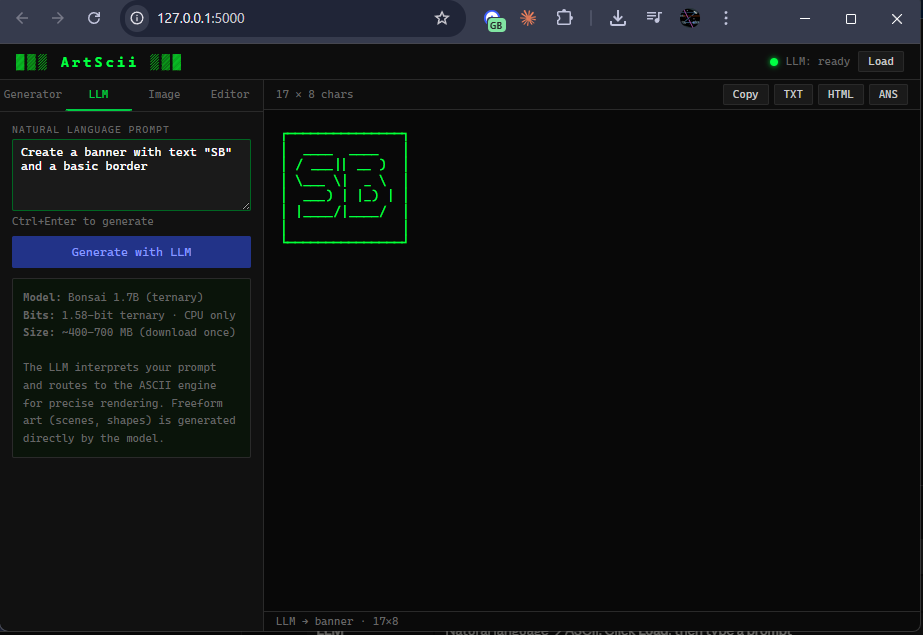

# ▓▒░ ArtScii ░▒▓

A local ASCII art studio with a web dashboard, terminal UI, and a built-in 1.58-bit LLM — no cloud, no subscriptions, runs entirely on your machine.



---

## Features

| | |
|---|---|
| **Generator** | Convert text to ASCII art using 900+ pyfiglet fonts, with border styles and width control |
| **LLM** | Type a natural language prompt — the model interprets intent and renders the art |
| **Image → ASCII** | Drag-and-drop any image and convert it to ASCII using multiple character sets |
| **ANSI colour editor** | Select text in the preview and apply any of the 16 standard ANSI colours |
| **Export** | Save as `.txt`, `.html` (with colours), or `.ans` |
| **Terminal UI** | Full TUI version via Textual — same features, no browser needed |

---

## LLM Integration

ArtScii ships with support for **Bonsai 1.7B**, a 1.58-bit ternary model (~400–700 MB). It runs entirely on CPU — no GPU, no Ollama, no external server.

The LLM uses a hybrid pipeline:

```
"Create a banner for 'SB Tech' with a double border"
          │
          ▼
    Bonsai 1.7B  (intent parsing)
    → { type: "banner", text: "SB Tech", font: "big", border: "double" }
          │
          ▼
    pyfiglet engine  (precise rendering)
          │
          ▼
    Clean, aligned ASCII art
```

For freeform requests ("draw a house", "make a skull") the model generates raw ASCII directly.

---

## Requirements

- Python **3.10+**
- Windows, macOS, or Linux
- ~1 GB free disk space (for the model)

---

## Setup

### 1 — Install core dependencies

```bash
pip install -r requirements.txt
```

### 2 — Install the LLM runtime

```bash
python setup_llm.py
```

This installs `llama-cpp-python` using pre-built CPU wheels — no compiler or MSVC required. Falls back to a source build if no wheel is available for your Python version.

### 3 — Download the model (one time)

```bash
python download_model.py
```

Downloads **Bonsai 1.7B** (ternary GGUF) from [prism-ml/Ternary-Bonsai-1.7B-gguf](https://huggingface.co/prism-ml/Ternary-Bonsai-1.7B-gguf) into the `models/` folder. The model is not committed to this repo — you download it once and it stays local.

> **Skipping the LLM?** Steps 2 and 3 are optional. The Generator, Image, and Editor modes work without any model.

---

## Usage

```bash
# Web dashboard (opens at http://127.0.0.1:5000)
python run.py

# Web dashboard + auto-open browser
python run.py --open

# Terminal UI
python run.py --tui

# Custom port
python run.py --port 8080
```

### Web dashboard

Once running, open `http://127.0.0.1:5000` in any browser.

| Tab | How to use |
|---|---|
| **Generator** | Type text, pick a font from the searchable list, choose a border, hit Generate |
| **LLM** | Click **Load** to load the model, type a natural language prompt, hit Generate |
| **Image** | Drag an image onto the drop zone, adjust width and character set, hit Convert |
| **Editor** | Select text in the preview, pick a colour from the palette, click Apply |

The preview pane is editable — you can type directly in it. The toolbar gives you **Copy**, **TXT**, **HTML**, and **ANS** export.

### Terminal UI

```
Ctrl+G   Generate from text input
Ctrl+L   Generate with LLM
Ctrl+E   Export to exports/art.txt
Ctrl+R   Random font
Q        Quit
```

---

## Project structure

```
ArtScii/
├── app/
│   ├── ascii_engine.py   # text → ASCII (pyfiglet), image → ASCII (Pillow), borders
│   ├── ansi.py           # ANSI escape codes, 16-colour palette, HTML conversion
│   ├── llm.py            # Bonsai GGUF wrapper (llama-cpp-python), hybrid pipeline
│   ├── server.py         # Flask REST API
│   └── tui.py            # Textual terminal UI
├── web/
│   ├── index.html        # Dashboard
│   ├── style.css         # Dark terminal theme
│   └── app.js            # Frontend logic
├── models/               # GGUF model lives here (not committed)
├── exports/              # Exported art lands here (not committed)
├── download_model.py     # One-time model download from HuggingFace
├── setup_llm.py          # llama-cpp-python installer
├── requirements.txt      # Core Python dependencies
└── run.py                # Entry point
```

---

## API endpoints

The Flask server exposes a small REST API, useful if you want to script or extend ArtScii.

| Method | Path | Body | Description |
|---|---|---|---|
| `GET` | `/api/fonts` | — | List all available pyfiglet fonts |
| `GET` | `/api/palette` | — | ANSI 16-colour palette |
| `POST` | `/api/generate/text` | `{text, font, border, width, centered}` | Text → ASCII |
| `POST` | `/api/generate/image` | `{image (base64), width, char_set, invert}` | Image → ASCII |
| `POST` | `/api/art/border` | `{art, style}` | Add border to existing art |
| `POST` | `/api/llm/load` | — | Start loading the LLM model |
| `GET` | `/api/llm/status` | — | Model status (`not_loaded` / `loading` / `ready` / `error`) |
| `POST` | `/api/llm/generate` | `{prompt}` | Generate art from natural language |
| `POST` | `/api/export` | `{art, format}` | Export art (`txt` / `html` / `ans`) |

---

## Dependencies

| Package | Purpose | Licence |
|---|---|---|
| [Flask](https://flask.palletsprojects.com/) | Web server | BSD-3 |
| [pyfiglet](https://github.com/pwaller/pyfiglet) | 900+ ASCII fonts | MIT |
| [Pillow](https://python-pillow.org/) | Image → ASCII conversion | HPND |
| [Textual](https://github.com/Textualize/textual) | Terminal UI framework | MIT |
| [Rich](https://github.com/Textualize/rich) | Terminal rendering | MIT |
| [llama-cpp-python](https://github.com/abetlen/llama-cpp-python) | GGUF model inference | MIT |
| [huggingface-hub](https://github.com/huggingface/huggingface_hub) | Model download | Apache-2.0 |

---

## Licence

[MIT](LICENSE)
